# 作業 1: 說明HTTPS的TLS1.2、TLS1.3差異，並擷取封包說明之

(1)撰寫重點，請參考PA(DAY1-1)投影片  
(2)TLS1.2、1.3之差異舉例，可以使用不同網站。

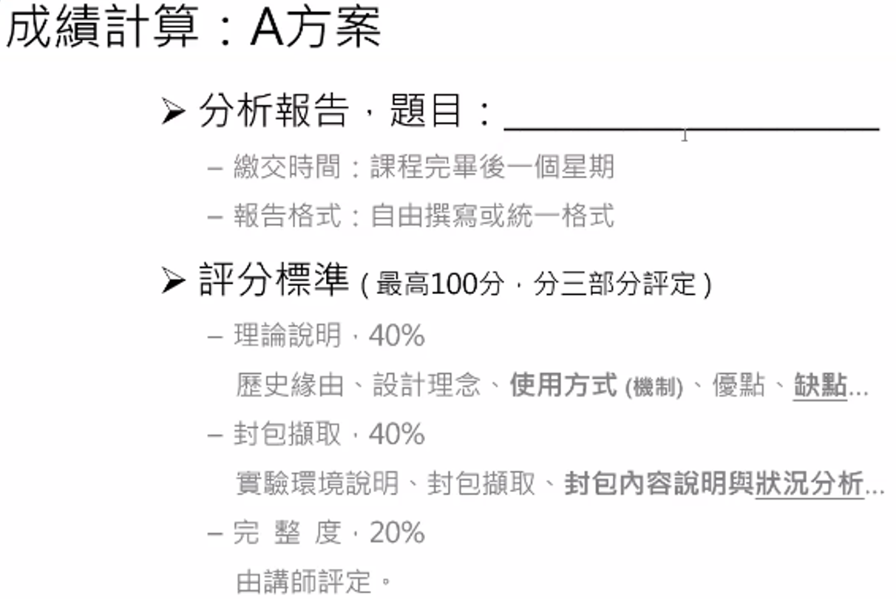


-----

## 什麼是 SSL/TLS？

SSL/TLS 是一種網絡加密協議，可在 Internet 上提供加密通信。Netscape 是 1990 年著名的網絡瀏覽器公司，首先開發了 SSL 並將其添加到他們的瀏覽器中。後來它被包括 Netscape 和 Microsoft 在內的一組公司的 Internet 工程任務組稱為 TLS。SSL 1.0 從未向公眾發布。SSL 的旅程始於 1994 年。 

通常所說的 HTTPS 協議，說白了就是 “HTTP 協議” 和 “SSL/TLS 協議” 的組合。SSL 是 “Secure Sockets Layer” 的縮寫，中文意思為“安全套接層”，而 TLS 則是標準化之後的 SSL。


TLS（Transport Layer Security Protocol，傳輸層安全協議）主要目的是提供隱私和資料兩個通訊應用之間的完整性。該協議由兩層組成：TLS 記錄協議（TLS Record）和 TLS 握手協議（TLS Handshake）。

當使用 TLS 時，客戶端和伺服器之間的連線具有以下一個或多個屬性：

* 連線私密性：使用對稱加密演算法用於加密資料的傳輸，例如 AES \[AES\], RC4 \[SCH\] 等
* 可以使用公鑰加密來驗證通訊方的身份
* 連線可靠性：傳送的每個訊息都使用 MAC（訊息認證碼） 進行完整性檢查

## SSL/TSL 歷史

SSL/TLS 的歷史很早就可以追溯到萬維網的說法。讓我們按時間順序看一下 SSL/TLS 的旅程：

1. SSL/TLS 的旅程始於 1994 年 Netscape Navigator 發布 SSLv2 時。
2. 幾個月後，Netscape 在 SSLv2 中發現了一個巨大的漏洞，因此他們在 1995 年發布了 SSLv3。
3. 1996 年，Internet Engineering Task Force 組建了一個小組，聚集了包括 Netscape 和 Microsoft 在內的多家公司，研究 Web 瀏覽器加密的標準化版本。該小組決定在 1999 年將名稱從 SSL 更改為 TLS。這就是 TLSv1.0 發布的方式（RFC 2246）。從技術上講，SSL v3 和 TLS v1.0 是相同的。
4. 研究人員在 TLSv1.0 協議中發現了幾個漏洞。還發現TLSv1.1容易受到BEAST攻擊。2006 年發布了新版本的 TSLv1.2 (RFC 4546)，解決了所有漏洞。
5. 隨著一些改革的日子一天天過去，TLS v1.2 (RFC 5246) 於 2008 年發布，並於 2013 年納入所有主要瀏覽器。
6. TLSv1.3 的初稿創建於 2017 年，並於 2018 年發布（RFC 8446）。

整體來看看 SSL/TLS 是怎麼運作的。

[](https://rickhw.github.io/images/ComputerScience/HTTPS-TLS/HowSSLWorks.png "How SSL Works?")

圖中包含了幾個角色：

* Certificate Authoriy (CA): 數位憑證認證機構，是負責發放和管理 `數位憑證` 的權威機構。
* Browser Vendor: 瀏覽器的供應者，像是 Google、Microsoft、Apple
* Client App: 目標瀏覽的應用程式
* Web Server: 網站服務器

整個流程如下：

1. CA (Godaddy): 發一張 root certificate 給所有 browser 開發者
2. Browser Vendor (Google, Mozilla): root certificate 會包在 App (ex 瀏覽器) 發布給使用者。
3. CSR (certificate signing request): 瀏覽器對 CA 發出 CSR 請求
    * 目的是針對目前 WebSite 的 Domain 做認證
4. CA 回傳簽可的憑證 (Signed Certificate)
    * 代表 WebSite Domain 的合法性
5. Client App (browser) 對 Web Server 發出請求
6. Web Server 回傳請求給 Client App
7. Client App 驗證 WebSite 的 Domain Certificate

-----

下圖是 SSL 整個通訊協議過程的流程圖：

[](https://rickhw.github.io/images/ComputerScience/HTTPS-TLS/SSL-Communication.jpg "SSL Communication Flow Diagram")

* `階段一 (Authentication)`：使用 Public / Asymmetric Key Encryption Algorithms.
  * `Step 1`: Client 送出 Hello 訊息到 Server
  * `Step 2`: Server 收到 Hello 後回覆 Hello 訊息
  * `Step 3`: Client 驗證 Server 回傳的 SSL Certificate
  * `Step 4`: (Optional) Client 傳送 SSL Certifiate 給 Server
  * `Step 5`: (Optional) Server 驗證 Client 回傳的 SSL Certifiate
* `階段二 (Key Exchange)`：使用 Public / Asymmetric Key Encryption Algorithms/Key Exchange protocol.
    *   `Step 6`: Client 送出 Key Exchange 的請求
  * `Step 7`: 改變 Cipher Spec
  * `Step 8`: Client 端完成請求
  * `Step 9`: Server 端依照請求，改變 Cipher Spec
  * `Step 10`: Server 端完成請求
* `階段三 (Encrypted Data Transfer)`：使用 Private / Symmetric Key Encryption Algorithms
  * `Step 11`: 使用對稱式加密傳輸資料。

前面階段一、二 稱 `SSL Handshake Protocol`，主要目的是認證 Server 是否合法，進而決定資料傳輸過程使用的對稱式金鑰；階段三則稱為 `SSL Record Protocol`，主要目的就是在安全的傳輸過程，使用 `對稱式加密演算法` 傳輸資料。

-----

## 階段一：Authentication (Handsharke)

這個階段在 `公開傳輸` 的過程，使用 `非對稱加密演算法`。

* `Step 1`: Client 送出 Hello 到 Server，包含以下訊息：
    1. `SSL Version`: 版本號碼可以是 sslv3, tls1.0, tls1.1, tls1.2
    2. [Cipher Suites](https://en.wikipedia.org/wiki/Cipher_suite) : 使用在 TLS 時的 演算法集合名稱，詳細後面描述
    3. 如果 `金鑰交換階段` 要使用 RSA ，那麼會再產生一個 Client Random Number.
* `Step 2`: Server 準備回給 Client 的 Hello 訊息，其中包含了：
  1. SSL Version
  2. Cipher Suites
  3. 支援、且同意的資料壓縮方法
    4.  SSL Certificate: 這是整個步驟中最重要的資訊。
        *   如果之後 `金鑰交換階段` 使用 RSA ，則會再產生一個隨機數 (Server Random Number)，用在金要交換階段生成對稱金鑰用。
  5. (optional) Client Certificate
  6. Hello Done:
* `Step 3`:
    1.  Client 收到 Server 回傳的 SSL Certificate，就會檢查是哪個 CA 簽發的憑證
    2.  然後從 Browser 的 Cert Store 取出對應的數位簽章，從中取得 Public Key，與 SSL Certificate 的 Public Key 比對。
  3. 如果有問題，表示發生 [中間人攻擊, Man-in-the-middle attack (MITM)](https://en.wikipedia.org/wiki/Man-in-the-middle_attack)
* `Step 4`: (optional) Client 發送 Certificate 給 Server
* `Step 5`: (optional) Server 驗證 Client 的 Ceritifcate

### [](#Cipher-Suites "Cipher Suites")Cipher Suites

在 `Step 1` Client 送出 Hello 訊息時，依照 SSL Version 的訊息，會包含一些此版本支援的 `協議與演算法組合`，這個組合稱為 `Cipher Suites`，這個組合會被用在整個 SSL Session 過程中。Cipher Suites 的名稱大概長得像下面這樣：

*   TLS\_ECDHE\_RSA\_WITH\_AES\_128\_GCM\_SHA256
*   TLS\_ECDHE\_ECDSA\_WITH\_CHACHA20\_POLY1305\_SHA256
*   TLS\_ECDHE\_RSA\_WITH\_AES\_128\_GCM\_SHA256
*   TLS\_RSA\_WITH\_AES\_128\_GCM\_SHA256

上述的 Cipher Suite 名稱在 RFC 有標準定義命名規則，上述的範例是 TLS 使用的標準規則，定義在 [RFC 2246, TLS v1.0](https://datatracker.ietf.org/doc/html/rfc2246) , [RFC 4346, TLS v1.1](https://datatracker.ietf.org/doc/html/rfc4346) , [RFC 5246, TLS v1.2](https://datatracker.ietf.org/doc/html/rfc5246) , and [RFC 8446, TLS v1.3](https://datatracker.ietf.org/doc/html/rfc8446) 。

命名格式如下：

> `L1`\_`L2`\_`L3`\_WITH\_`L4`\_`L5`\_`L6`

*   `L1`: 使用哪一個傳輸層通訊協議，有 TLS、SSL。
*   `L2`: 描述使用哪個 [Key Exchange](https://en.wikipedia.org/wiki/Key_exchange) 演算法，像是 RSA、DH (Diffie–Hellman)
    *   `ECDHE` 全名 `Elliptic Curve Diffie-Hellman Ephemeral`，中文 `橢圓曲線迪菲-赫爾曼密鑰交換`，是一種 `匿名密鑰協議 (Key-agreement protocol)`。
    *   這是 [Diffie–Hellman key exchange](https://en.wikipedia.org/wiki/Diffie%E2%80%93Hellman_key_exchange) 的變種，採用 `橢圓曲線密碼學` 來加強性能與安全性。
    *   `ECDH` 則是
*   `L3`: 交握過程的認證機制
    *   `RSA`
*   `L4`: session cipher，加密的 Size
    *   範例：`AES_128`
*   `L5`: 對稱式加密演算法法的操作模式
    *   `GCM` type of encryption (cipher-block dependency and additional options)
*   `SHA` (SHA2)hash function. For a digest of 256 and higher. Signature mechanism. indicates the message authentication algorithm which is used to authenticate a message.
*   `256` Digest size (bits).

> 附註：Cipher Suite 的命名規則，在 RFC 與部分實作有所差異，OpenSSL and [s2n, c99](https://github.com/aws/s2n-tls) 則使用另一種命名方式。相關對照表可以參考 [Supported protocols and ciphers between viewers and CloudFront](https://docs.aws.amazon.com/AmazonCloudFront/latest/DeveloperGuide/secure-connections-supported-viewer-protocols-ciphers.html#secure-connections-openssl-rfc-cipher-names) 的整理。

下圖是 AWS ELB / CLB 中的 SSL Cipher Suite 設定截圖：

[](https://rickhw.github.io/images/ComputerScience/HTTPS-TLS/AWS-CLB-CipherSuite.png)

更多 ELB Security Policy 定義參閱: [Predefined SSL security policies for Classic Load Balancers](https://docs.aws.amazon.com/elasticloadbalancing/latest/classic/elb-security-policy-table.html)

* * *

[](#階段二：Key-Exchange "階段二：Key Exchange")階段二：Key Exchange
--------------------------------------------------------

同階段一，也是在 `公開傳輸` 的過程，使用 `非對稱加密演算法`。這個階段的目的：

> 產生一個用來在 `階段三` 資料交換時，使用的 `對稱式加密演算法` 的 `對稱式金鑰 (Shared Secret)`

在一個公開透明的傳輸通道要產生金曜、然後傳輸，最常見的方法是 RSA 或者 `Deffie Hellman` 演算法。

*   `Step 6`: Client 送出 Key Exchange 的請求
*   `Step 7`: 改變 Cipher Spec
*   `Step 8`: Client 端完成請求
*   `Step 9`: Server 端依照請求，改變 Cipher Spec
*   `Step 10`: Server 端完成請求

### [](#RSA-Key-Exchange "RSA Key Exchange")RSA Key Exchange

*   `Pre-master secret`: 使用 RSA 取得金鑰，那麼在 `Step1` 就會產生 `Random Number`，然後使用 Server 憑證裡的公鑰加密，這個 Random Number 稱為 `Pre-master secret (PMS)`
*   `Client's Random Number`: Client 端產生的一組隨機碼
*   `Server's Random Number`: Server 端產生的一組隨機碼

透過這三個數字的隨機性，就可以產生 `資料傳輸階段` 時，`對稱式加密演算法` 所需要的 `加密金鑰 (Master Secret)`。

但是用 RSA 並不具備 PFS 特性，所以現在大多使用 DH 演算法。

### [](#Forward-Secrecy "Forward Secrecy")Forward Secrecy

中文翻譯成 `向前保密`，有時候也稱為 `完全向前保密 (Perfect Forward Secrecy, PFS)`，是密碼學中通訊協議的安全屬性。

TLS 基於 DHE (迪菲-赫爾曼金鑰交換) 演算法，就滿足 PFS 的特性，以下是滿足的演算法：

*   DHE-RSA
*   DHE-DSA
*   DHE-ECDSA

基於 ECDHE (橢圓曲線迪菲-赫爾曼金鑰交換) 的安全通訊，包含了：

*   ECDHE-RSA
*   ECDHE-ECDSA

> 更多參閱 Wikipedia 說明: [Forward Secrecy](https://en.wikipedia.org/wiki/Forward_secrecy)

### [](#Diffie-Hellman-Key-Exchange "Diffie-Hellman Key Exchange")Diffie-Hellman Key Exchange

大多時候簡稱 `DH 演算法`，是一種安全協議，主要目的：

> 雙方在沒有任何預先條件之下，透過公開的管道 (Public Channel, Unsafe) 建立一個金鑰，這個金鑰可以在後續的通訊過程作為加密金鑰來加密資料。

與 RSA 不一樣的是，DH 演算法具備了 `向前安全性 (Forward Secrecy)`，所以被廣泛運用在通訊傳輸的安全加密。

> DH 演算法詳細推演過程，參閱 [Wikipedia](https://en.wikipedia.org/wiki/Diffie%E2%80%93Hellman_key_exchange)

DH 演算法的弱點就是 `中間人攻擊`，因為整個演算法並沒有跟 `身份驗證` 有關的資訊，所以理想的做法就是要有個機制可以做身份識別，這也就是為什麼用自簽憑證的 HTTPS 瀏覽器會看出現警告訊息的原因。

* * *

[](#階段三：Encrypted-Data-Transfer-Record-Protocol "階段三：Encrypted Data Transfer / Record Protocol")階段三：Encrypted Data Transfer / Record Protocol
---------------------------------------------------------------------------------------------------------------------------------------------

進入資料傳輸階段，這個階段也稱為 `Record protocol`，使用 `對稱加密演算法` 加密瀏覽器與伺服器之間傳輸的資料。這個過程必須滿足以下特性：

1.  `保密性 (Confidentiality)`: 透過對稱式加密達到保密性，使用之前提到的 `Master Secret` 做資料加密。
2.  `完整性 (Integrity)`: 透過 [MAC (Message Authentication Code)](https://zh.wikipedia.org/zh-tw/%E8%A8%8A%E6%81%AF%E9%91%91%E5%88%A5%E7%A2%BC) 確認，MAC 則是透過 Hash 演算法計算得來。

下圖是 Record Protocol 的結構：

[](https://rickhw.github.io/images/ComputerScience/HTTPS-TLS/Record-Protocol.jpeg)  
圖片來源：[SSL Record Protocol](https://www.youtube.com/watch?v=bSMRf0lAuzw)

結構與流程說明如下：

1.  Application Data: 應用程式資料會被拆分成若干份 Fragment
2.  Fragment: 每個傳輸資料會被拆分成幾個區塊後，個別傳送，這個區塊稱為 Fragment
    *   每個 Fragment 會經過壓縮演算法進行資料壓縮
3.  MAC: 用來確認每個 Fragment 的完整性驗證碼
    *   每個壓縮過後的資料，透過 Hash 計算出 MAC 值
    *   這個 MAC 值附加在壓縮資料之後
4.  Encrypt: 取得 Fragment 的 MAC 之後，使用 Secret Key 加密這兩個
5.  SSL Record Header: 最後附上 Record Header


**密碼套件：**
---------

這是在處理 SSL/TLS 時需要了解的重要事項之一。密碼套件是一組有助於保護 TLS 會話的算法。一個密碼套件由三種密碼算法組成。

1.  [密鑰交換算法](https://thesecmaster.com/a-mathematical-explanation-of-the-diffie-hellman-key-exchange-protocol/)：該算法用於通過不安全的公共網絡（如 Internet）在客戶端和服務器之間安全地交換對稱密鑰。
2.  [批量加密算法](https://blog.storagecraft.com/5-common-encryption-algorithms/)：批量加密算法用於加密客戶端和服務器之間交換的應用程序數據。
3.  [消息驗證碼](https://en.wikipedia.org/wiki/Message_authentication_code)：用於執行握手完整性檢查。這個過程從握手過程中涉及的每條消息中取出一部分頭信息，將它們組合起來，並生成一個摘要消息。此摘要消息將與另一方共享，以確保握手過程未被篡改。

在此處訪問鏈接以了解支持的密碼套件和協議版本： [支持的密碼套件和協議版本](https://help.fortinet.com/fweb/586/Content/FortiWeb/fortiweb-admin/supported_cipher_suites.htm)

**DH密鑰交換流程：**
-------------

加密是使用 SSL/TLS 的主要原因。“密鑰”是加密的主要實體。沒有密鑰，加密就無法工作。所以我們認為展示[密鑰交換](https://thesecmaster.com/a-mathematical-explanation-of-the-diffie-hellman-key-exchange-protocol/)背後的邏輯很重要。

加密協議主要分為兩大類——對稱加密和非對稱加密。實際加密發生在非對稱加密中，因為它使用兩個密鑰，私鑰和公鑰。 

讓我們看看非對稱加密協議中的密鑰交換是如何發生的：

讓我們假設“a”是客戶端的私鑰。'b' 是服務器的私鑰。兩個大素數，“p”和“g”是將與客戶端和服務器共享的公鑰。

創建加密密鑰的數學公式是 g^a mod p。

階段1：

步驟 1：當客戶端請求連接到服務器時。服務器發送帶有“p”和“g”值的公共證書。

步驟 2：客戶端生成客戶端加密密鑰。

g^a mod p = A

步驟 3：服務器生成其加密密鑰。

g^b 模 p = B

第 4 步：客戶端和服務器都交換他們的加密密鑰。

階段2：

步驟 5：服務器和客戶端都使用相同的數學函數來計算密鑰。

客戶端密鑰：B^a mod p = K

服務器密鑰：A^b mod p = K

K 用作對稱密鑰。

**TLS v1.2：**
-------------

由於 TLS v1.0、TLS v1.1 和 TLS v1.2 之間沒有顯著差異。最重要的是，TLS v1.2 更接近宇宙。我們認為解釋 TLS v1.2 握手過程很好。在 TLS v1.2 中有大量消息在客戶端和服務器之間來回移動。我們將在逐步過程中查看這些內容。詳細過程請訪問： [Decoding TLS v1.2 protocol Handshake with Wireshark](https://thesecmaster.com/decoding-tls-v1-2-protocol-handshake-with-wireshark/)

**第 1 步：** 整個握手過程從客戶端向服務器發送“client hello”消息開始。此消息包含加密信息，例如支持的 TLS 協議、所有支持的密碼套件、28 字節隨機數、UTC 時間、會話 ID 和服務器的 URL。

**步驟2：** 響應Client的“client hello”消息，Server發送“server hello”消息。此消息包括服務器從客戶端提供的協議中選擇的最高支持的 TLS 協議 CipherSuite。服務器還發送其證書以及會話 ID、UTC 時間和另一個 28 字節的隨機數。

**第 3 步：** 客戶端驗證服務器的證書。驗證後，它發送一個隨機字節串，稱為“pre-master secret”，並使用服務器證書的公鑰對其進行加密。

**第 4 步：** 服務器收到預主密鑰後，客戶端和服務器都生成一個主密鑰和會話密鑰（臨時密鑰）。這些會話密鑰將用於對稱加密數據。

**第 5 步：** 客戶端現在向服務器發送“更改密碼規範”消息，讓它知道它將使用會話密鑰切換到對稱加密。與此同時，它還發送“客戶端完成”消息。

**步驟6：** 響應客戶端的“更改密碼規範”消息，服務器將其安全狀態切換為對稱加密。服務器通過發送“服務器完成”消息來結束握手。

要完成所有這些過程，可能需要 0.25 到 0.5 秒。在 HTTPS 中，第二部分的前半部分是在交換應用程序數據之前完成 TCP 和 TLS 握手協議。這就是 HTTPS 站點加載時間比 HTTP 更長的原因。

**TLS v1.3：**
-------------

TLS 協議的最新版本是 v1.3。這個版本背後的主要思想是通過減少客戶端和服務器之間的來回消息來減少握手過程的時間。這種縮短的握手過程使應用程序數據的交換以比舊版 TLS 協議更快的方式開始。

**第 1 步： ** TLS 1.3 握手也與 TLS 1.2 的情況一樣，以“Client Hello”消息開始。客戶端當然會發送支持的密碼套件列表並猜測服務器可能選擇哪種密鑰協商協議。客戶端還發送其用於該特定密鑰協商協議的密鑰份額。

**第二步：** 服務器回复“Client Hello”消息，回複選擇的密鑰協商協議。“Server Hello”消息還包含服務器的密鑰共享、其證書和“Server Finished”消息。

**步驟 3：** 現在，客戶端檢查服務器共享的證書，生成對稱密鑰，因為它具有服務器的密鑰共享，並發送“客戶端完成”消息。從這一點開始，客戶端和服務器都開始通過加密消息進行通信。

在 TLS v1.3 中，整個過程從六步縮短為三步。這將節省大約 25% 到 50% 的時間來完成 TLS 過程。

---


## Lab

**環境**
---

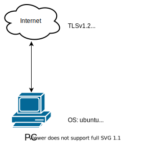

>TLSv1.2
<https://tls-v1-2.badssl.com>
104.154.89.105

>TLSv1.3
<https://zh.wikipedia.org/wiki/>
103.102.166.224

>OS: ubuntu
browser: firefox
tool: wireshark


**ubuntu 設置**
---

```bash
### 設置 SSLKEYLOGFILE 環境變數 ###
echo "export SSLKEYLOGFILE=$HOME/sslkeylog.log" >> ~/.profile
```

```bash
### 設置後重新啟動 ###
reboot
```

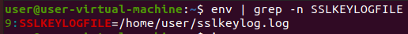

```bash
### 察看環境變數是否有 SSLKEYLOGFILE ###
env | grep -n SSLKEYLOGFILE
```


**wireshark 設置**
---

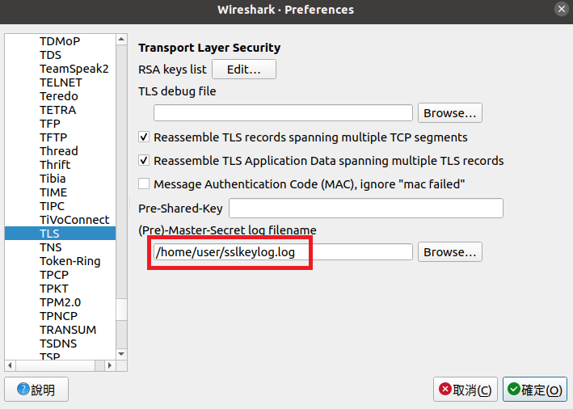
Edit -> Preferences -> Protocols -> TLS -> (Pre)-Master-Secret log filename -> Browse... -> "/home/user/sslkeylog.log"

**封包截取**
---
**TLSv1.2**
>TLSv1.2
<https://tls-v1-2.badssl.com>
104.154.89.105

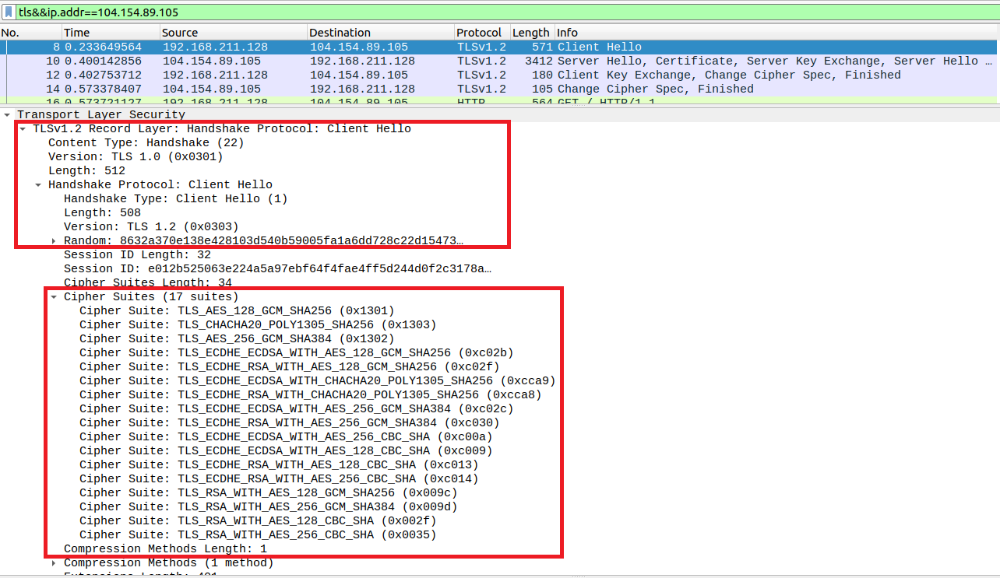

**Client Hello**


server_name: tls-v1-2.badssl.com

Random: 8632a370e138e428103d540b59005fa1a6dd728c22d15473…

Session ID: e012b525063e224a5a97ebf64f4fae4ff5d244d0f2c3178a…

Supported Version: 
TLS 1.3 (0x0304)
TLS 1.2 (0x0303)

Client 支援的雜湊算法
```
            Extension: signature_algorithms (len=24)
                Type: signature_algorithms (13)
                Length: 24
                Signature Hash Algorithms Length: 22
                Signature Hash Algorithms (11 algorithms)
                    Signature Algorithm: ecdsa_secp256r1_sha256 (0x0403)
                        Signature Hash Algorithm Hash: SHA256 (4)
                        Signature Hash Algorithm Signature: ECDSA (3)
                    Signature Algorithm: ecdsa_secp384r1_sha384 (0x0503)
                        Signature Hash Algorithm Hash: SHA384 (5)
                        Signature Hash Algorithm Signature: ECDSA (3)
                    Signature Algorithm: ecdsa_secp521r1_sha512 (0x0603)
                        Signature Hash Algorithm Hash: SHA512 (6)
                        Signature Hash Algorithm Signature: ECDSA (3)
                    Signature Algorithm: rsa_pss_rsae_sha256 (0x0804)
                        Signature Hash Algorithm Hash: Unknown (8)
                        Signature Hash Algorithm Signature: Unknown (4)
                    Signature Algorithm: rsa_pss_rsae_sha384 (0x0805)
                        Signature Hash Algorithm Hash: Unknown (8)
                        Signature Hash Algorithm Signature: Unknown (5)
                    Signature Algorithm: rsa_pss_rsae_sha512 (0x0806)
                        Signature Hash Algorithm Hash: Unknown (8)
                        Signature Hash Algorithm Signature: Unknown (6)
                    Signature Algorithm: rsa_pkcs1_sha256 (0x0401)
                        Signature Hash Algorithm Hash: SHA256 (4)
                        Signature Hash Algorithm Signature: RSA (1)
                    Signature Algorithm: rsa_pkcs1_sha384 (0x0501)
                        Signature Hash Algorithm Hash: SHA384 (5)
                        Signature Hash Algorithm Signature: RSA (1)
                    Signature Algorithm: rsa_pkcs1_sha512 (0x0601)
                        Signature Hash Algorithm Hash: SHA512 (6)
                        Signature Hash Algorithm Signature: RSA (1)
                    Signature Algorithm: ecdsa_sha1 (0x0203)
                        Signature Hash Algorithm Hash: SHA1 (2)
                        Signature Hash Algorithm Signature: ECDSA (3)
                    Signature Algorithm: rsa_pkcs1_sha1 (0x0201)
                        Signature Hash Algorithm Hash: SHA1 (2)
                        Signature Hash Algorithm Signature: RSA (1)
```

Client 支援這些協議與演算法組合
```
            Cipher Suites (17 suites)
                Cipher Suite: TLS_AES_128_GCM_SHA256 (0x1301)
                Cipher Suite: TLS_CHACHA20_POLY1305_SHA256 (0x1303)
                Cipher Suite: TLS_AES_256_GCM_SHA384 (0x1302)
                Cipher Suite: TLS_ECDHE_ECDSA_WITH_AES_128_GCM_SHA256 (0xc02b)
                Cipher Suite: TLS_ECDHE_RSA_WITH_AES_128_GCM_SHA256 (0xc02f)
                Cipher Suite: TLS_ECDHE_ECDSA_WITH_CHACHA20_POLY1305_SHA256 (0xcca9)
                Cipher Suite: TLS_ECDHE_RSA_WITH_CHACHA20_POLY1305_SHA256 (0xcca8)
                Cipher Suite: TLS_ECDHE_ECDSA_WITH_AES_256_GCM_SHA384 (0xc02c)
                Cipher Suite: TLS_ECDHE_RSA_WITH_AES_256_GCM_SHA384 (0xc030)
                Cipher Suite: TLS_ECDHE_ECDSA_WITH_AES_256_CBC_SHA (0xc00a)
                Cipher Suite: TLS_ECDHE_ECDSA_WITH_AES_128_CBC_SHA (0xc009)
                Cipher Suite: TLS_ECDHE_RSA_WITH_AES_128_CBC_SHA (0xc013)
                Cipher Suite: TLS_ECDHE_RSA_WITH_AES_256_CBC_SHA (0xc014)
                Cipher Suite: TLS_RSA_WITH_AES_128_GCM_SHA256 (0x009c)
                Cipher Suite: TLS_RSA_WITH_AES_256_GCM_SHA384 (0x009d)
                Cipher Suite: TLS_RSA_WITH_AES_128_CBC_SHA (0x002f)
                Cipher Suite: TLS_RSA_WITH_AES_256_CBC_SHA (0x0035)
```


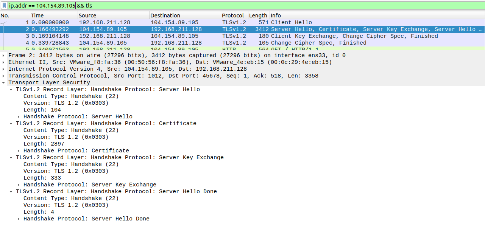


**Server Hello, Certificate, Server Key Exchange, Server Hello Done**

Random Bytes: 2426191f352b5955353441bf270b32964b1e1354a35264f5…

Session ID: 07a5fc74752ce6aa1525c22ff46a835be1fa7ae425cbffd0…

Cipher Suite: TLS_ECDHE_RSA_WITH_AES_256_GCM_SHA384 (0xc030)

Pubkey: 04425e42edf0e0e96322f66baa663d7d3e559a26115d2d0f…

Signature Algorithm: rsa_pkcs1_sha512 (0x0601)

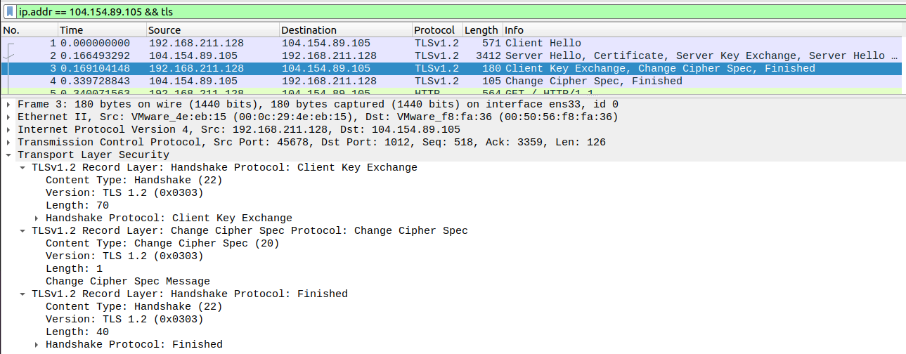

**Client Key Exchange, Change Cipher Spec, Finished**

Pubkey: 04f76173589b15a15f637ab4bd7c1ee47a77eff799d30a97…


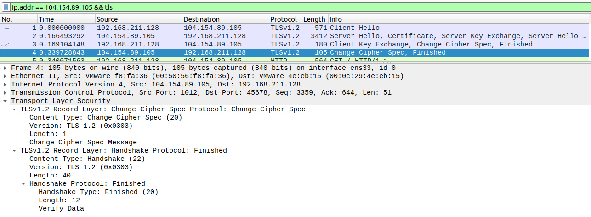
**Change Cipher Spec, Finished**

-----

**TLSv1.3**
>TLSv1.3
<https://zh.wikipedia.org/wiki/>
103.102.166.224


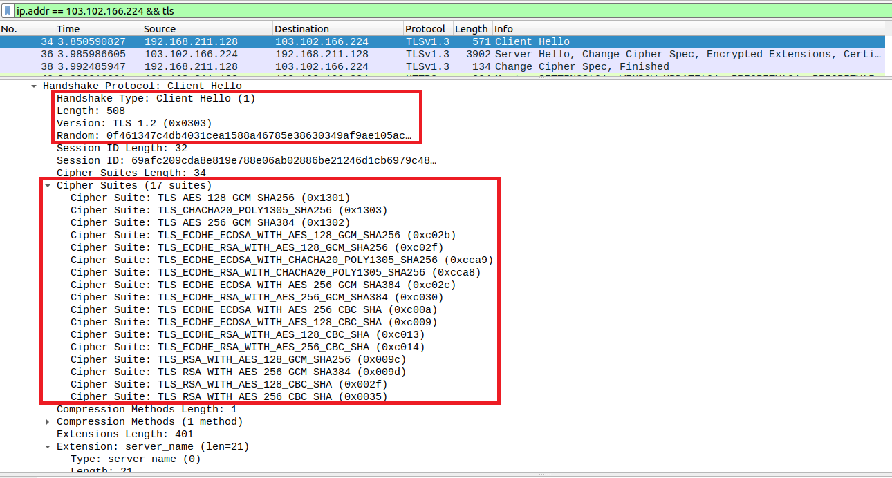
**Client Hello**

Server Name: zh.wikipedia.org

Random: 0f461347c4db4031cea1588a46785e38630349af9ae105ac…

Session ID: 69afc209cda8e819e788e06ab02886be21246d1cb6979c48…

Supported Version: 
TLS 1.3 (0x0304)
TLS 1.2 (0x0303)

psk_key_exchange_modes: psk_dhe_ke
- PSK 和 (EC)DHE 建立。在這種模式下，Client 和 Server 必須提供 "key_share" 值

Client 支援的雜湊算法
```
            Extension: signature_algorithms (len=24)
                Type: signature_algorithms (13)
                Length: 24
                Signature Hash Algorithms Length: 22
                Signature Hash Algorithms (11 algorithms)
                    Signature Algorithm: ecdsa_secp256r1_sha256 (0x0403)
                        Signature Hash Algorithm Hash: SHA256 (4)
                        Signature Hash Algorithm Signature: ECDSA (3)
                    Signature Algorithm: ecdsa_secp384r1_sha384 (0x0503)
                        Signature Hash Algorithm Hash: SHA384 (5)
                        Signature Hash Algorithm Signature: ECDSA (3)
                    Signature Algorithm: ecdsa_secp521r1_sha512 (0x0603)
                        Signature Hash Algorithm Hash: SHA512 (6)
                        Signature Hash Algorithm Signature: ECDSA (3)
                    Signature Algorithm: rsa_pss_rsae_sha256 (0x0804)
                        Signature Hash Algorithm Hash: Unknown (8)
                        Signature Hash Algorithm Signature: Unknown (4)
                    Signature Algorithm: rsa_pss_rsae_sha384 (0x0805)
                        Signature Hash Algorithm Hash: Unknown (8)
                        Signature Hash Algorithm Signature: Unknown (5)
                    Signature Algorithm: rsa_pss_rsae_sha512 (0x0806)
                        Signature Hash Algorithm Hash: Unknown (8)
                        Signature Hash Algorithm Signature: Unknown (6)
                    Signature Algorithm: rsa_pkcs1_sha256 (0x0401)
                        Signature Hash Algorithm Hash: SHA256 (4)
                        Signature Hash Algorithm Signature: RSA (1)
                    Signature Algorithm: rsa_pkcs1_sha384 (0x0501)
                        Signature Hash Algorithm Hash: SHA384 (5)
                        Signature Hash Algorithm Signature: RSA (1)
                    Signature Algorithm: rsa_pkcs1_sha512 (0x0601)
                        Signature Hash Algorithm Hash: SHA512 (6)
                        Signature Hash Algorithm Signature: RSA (1)
                    Signature Algorithm: ecdsa_sha1 (0x0203)
                        Signature Hash Algorithm Hash: SHA1 (2)
                        Signature Hash Algorithm Signature: ECDSA (3)
                    Signature Algorithm: rsa_pkcs1_sha1 (0x0201)
                        Signature Hash Algorithm Hash: SHA1 (2)
                        Signature Hash Algorithm Signature: RSA (1)
```

Client 支援這些協議與演算法組合
```
            Cipher Suites (17 suites)
                Cipher Suite: TLS_AES_128_GCM_SHA256 (0x1301)
                Cipher Suite: TLS_CHACHA20_POLY1305_SHA256 (0x1303)
                Cipher Suite: TLS_AES_256_GCM_SHA384 (0x1302)
                Cipher Suite: TLS_ECDHE_ECDSA_WITH_AES_128_GCM_SHA256 (0xc02b)
                Cipher Suite: TLS_ECDHE_RSA_WITH_AES_128_GCM_SHA256 (0xc02f)
                Cipher Suite: TLS_ECDHE_ECDSA_WITH_CHACHA20_POLY1305_SHA256 (0xcca9)
                Cipher Suite: TLS_ECDHE_RSA_WITH_CHACHA20_POLY1305_SHA256 (0xcca8)
                Cipher Suite: TLS_ECDHE_ECDSA_WITH_AES_256_GCM_SHA384 (0xc02c)
                Cipher Suite: TLS_ECDHE_RSA_WITH_AES_256_GCM_SHA384 (0xc030)
                Cipher Suite: TLS_ECDHE_ECDSA_WITH_AES_256_CBC_SHA (0xc00a)
                Cipher Suite: TLS_ECDHE_ECDSA_WITH_AES_128_CBC_SHA (0xc009)
                Cipher Suite: TLS_ECDHE_RSA_WITH_AES_128_CBC_SHA (0xc013)
                Cipher Suite: TLS_ECDHE_RSA_WITH_AES_256_CBC_SHA (0xc014)
                Cipher Suite: TLS_RSA_WITH_AES_128_GCM_SHA256 (0x009c)
                Cipher Suite: TLS_RSA_WITH_AES_256_GCM_SHA384 (0x009d)
                Cipher Suite: TLS_RSA_WITH_AES_128_CBC_SHA (0x002f)
                Cipher Suite: TLS_RSA_WITH_AES_256_CBC_SHA (0x0035)
```


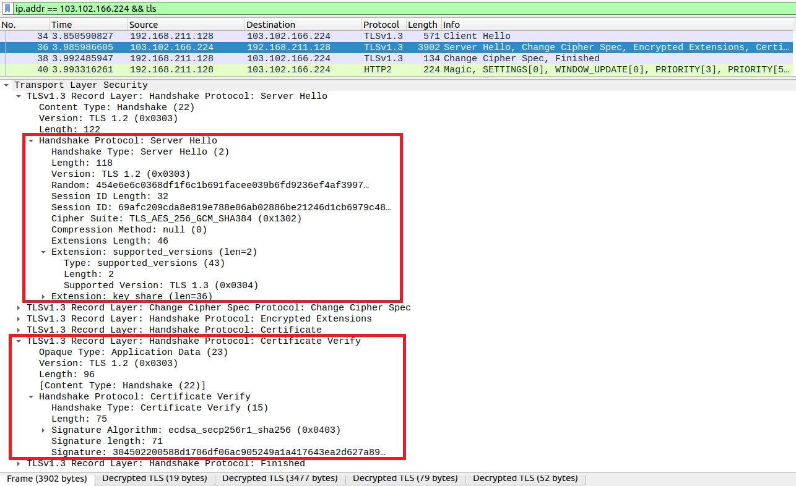
**Server Hello, Change Cipher Spec,Encrypted Extensions,Certificate,Certificate Verify, Finished**

Random: 454e6e6c0368df1f6c1b691facee039b6fd9236ef4af3997…

Session ID: 69afc209cda8e819e788e06ab02886be21246d1cb6979c48…

Cipher Suite: TLS_AES_256_GCM_SHA384 (0x1302)

Supported Version: TLS 1.3 (0x0304)

Key Exchange: bd6db65d05c9c9f15c8abbcc0709bb9583a914121ebc61c8…

Signature Algorithm: ecdsa_secp256r1_sha256 (0x0403)


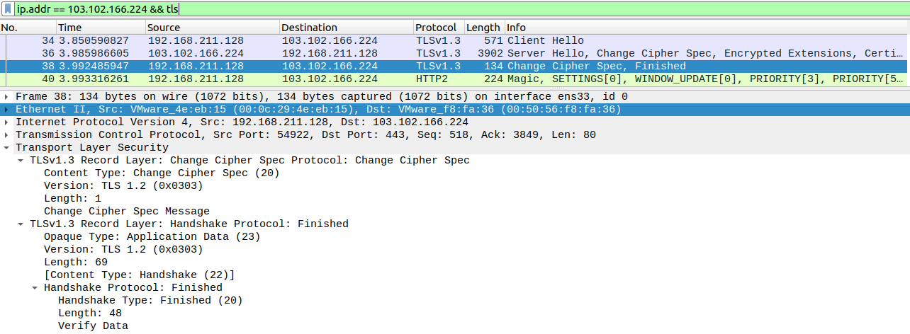
**Change Cipher Spec, Finished**


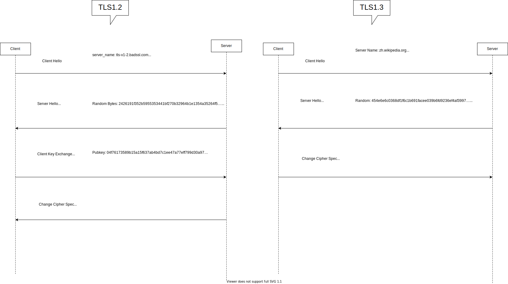


>TLSv1.2 最少會傳4個封包
TLSv1.3 最少會傳3個封包


-----

**online**
---
[this](https://github.com/rockexe0000/tls1.2-and-tls1.3-differ)


**pcapng file**
---
TLSv1.2
[tls-v1-2.badssl.com_202201101347.pcapng](./assets/pcapng/tls-v1-2.badssl.com_202201101347.pcapng)
TLSv1.3
[wikipedia_202201092059.pcapng](./assets/pcapng/wikipedia_202201092059.pcapng)


**pcapng file txt**
---
TLSv1.2
[clinethello_tls-v1-2.badssl.com_202201101347.txt](./assets/pcapng/txt/clinethello_tls-v1-2.badssl.com_202201101347.txt)
[serverhello_tls-v1-2.badssl.com_202201101347.txt](./assets/pcapng/txt/serverhello_tls-v1-2.badssl.com_202201101347.txt)
[clientfin_tls-v1-2.badssl.com_202201101347.txt](./assets/pcapng/txt/clientfin_tls-v1-2.badssl.com_202201101347.txt)
[serverfin_tls-v1-2.badssl.com_202201101347.txt](./assets/pcapng/txt/serverfin_tls-v1-2.badssl.com_202201101347.txt)


TLSv1.3
[clienthello_wikipedia_202201092059.txt](./assets/pcapng/txt/clienthello_wikipedia_202201092059.txt)
[serverhello_wikipedia_202201092059.txt](./assets/pcapng/txt/serverhello_wikipedia_202201092059.txt)
[clientfin_wikipedia_202201092059.txt](./assets/pcapng/txt/clientfin_wikipedia_202201092059.txt)


-----

## Referance

<https://rickhw.github.io/2021/08/20/ComputerScience/HTTPS-TLS/>

<https://www.thesecmaster.com/decoding-tls-v1-2-protocol-handshake-with-wireshark/>

<https://www.itread01.com/content/1544592078.html>

<https://www.thesecmaster.com/what-is-ssl-tls-how-ssl-tls-1-2-and-tls-1-3-differ-from-each-other/>


<https://halfrost.com/https-extensions/>


